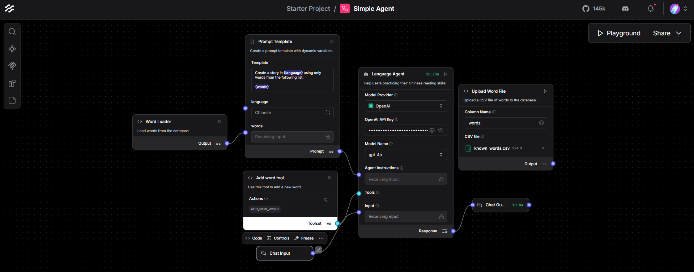
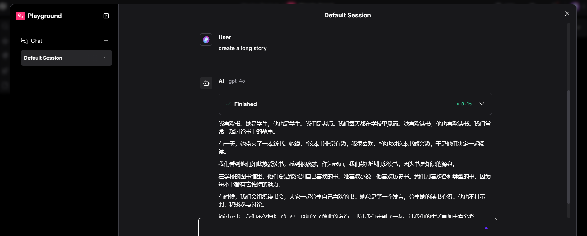

# Chinese Story Agent (Langflow)

An agentic LLM system built with **Langflow** and **OpenAI GPT-4o** that generates Chinese stories using a controlled vocabulary list.

This project demonstrates:
- Tool-calling agents
- Prompt parameterization
- Vocabulary-constrained generation
- Dockerized deployment
- Basic database integration

---

## Features

- Generate Chinese stories using predefined vocabulary
- Dynamic prompt template with parameters
- Word database (CSV-based)
- Tool support for adding new vocabulary
- Fully containerized with Docker

---

## Architecture

The system is built using a modular Langflow pipeline:

Word Loader → Prompt Template → Language Agent → Chat Output  
(+ Optional Tool: Add Word Tool)

Below is the flow architecture:



---

## Example Output

Example of the agent generating a long Chinese story using controlled vocabulary:



---

## Tech Stack

- Langflow
- OpenAI GPT-4o
- Docker & Docker Compose
- PostgreSQL
- CSV-based vocabulary storage

---

### Clone the repository

```bash
git clone https://github.com/YOUR_USERNAME/chinese-story-agent-langflow.git
cd chinese-story-agent-langflow


---

Start the system
---

```bash
docker compose up -d

This will automatically:

Start PostgreSQL

Start Langflow

Initialize the database

Launch the web interface

4. Open Langflow

Once the containers are running, open your browser and go to:

http://localhost:7860
5. Import the Flow

Click Import

Select:

flows/chinese_story_agent.json

Open Playground

Start generating stories

6. Stop the system

To stop the containers:

docker compose down

To completely reset the database:

docker compose down -v